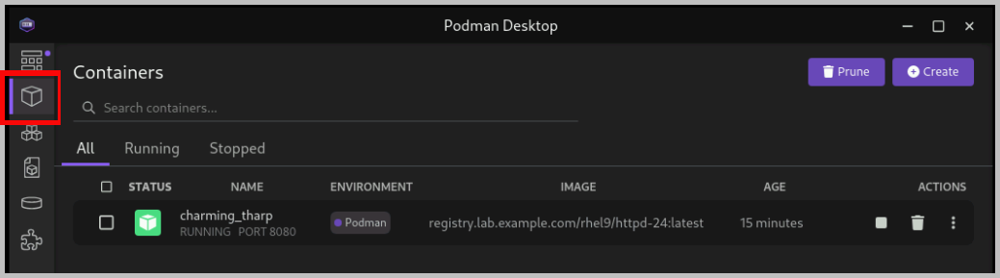
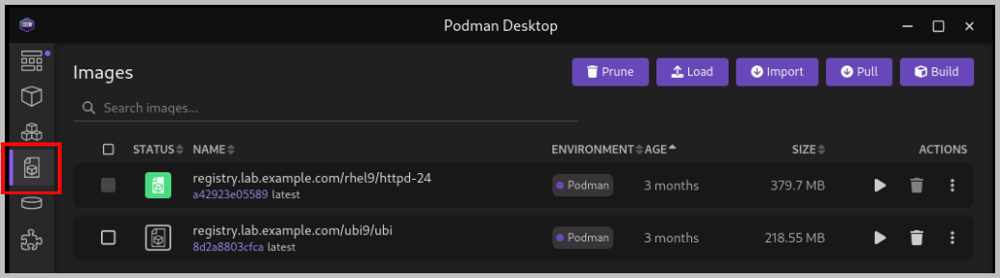
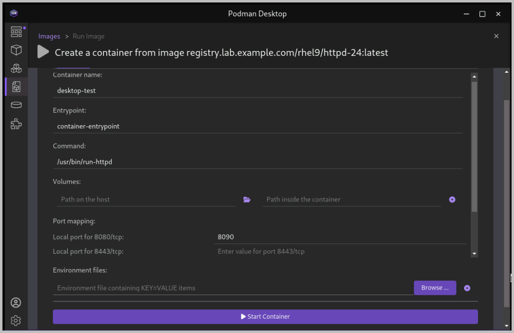
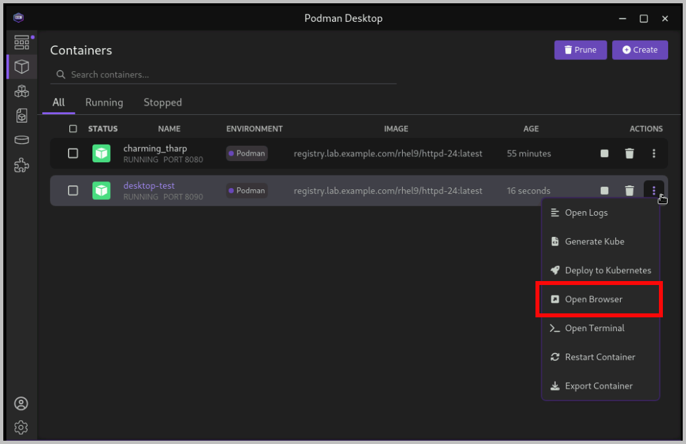

= Exercise: Can you contain your excitement to get hands-on?

== Acknowledgements

All credit for the steps in this exercise and the associated lab environment you are using go to the Red Hat Training development team! Find more fun exercises like this on containers in both our Red Hat System Administration II (RH134) and OpenShift Development I: Introduction to Containers with Podman (DO188) courses! Stop by our Red Hat Learning Subscription booth to learn more!

== Goals

You should be able to run containers in Podman by using the `podman run` command.
Resist the urge to use copy and paste! We learn a lot more when we type it out the long way.

== Getting Started

As the `student` user on the `workstation` machine, use the `lab` command to prepare your system for this exercise.

[subs="+quotes,+macros"]
----
[student@workstation ~]$ *lab start containers-creating*
----

[role='Checklist']
== Instructions

1. Use the `registry.lab.example.com/ubi9/ubi` image to create a new container that prints the `Hello Red{nbsp}Hat` text.
.. Log in to the classroom registry. Use `admin` as the username, and `redhat321` as the password.
+
--
[subs="+quotes,+macros"]
----
[student@workstation ~]$ *podman login registry.lab.example.com --tls-verify=false*
Username: *admin*
Password: *redhat321*
Login Succeeded!
----
--
.. Use the `podman pull` command to fetch the image from the registry.
+
--
[subs="+quotes,+macros"]
----
[student@workstation ~]$ *podman pull registry.lab.example.com/ubi9/ubi \
 --tls-verify=false*
Trying to pull registry.lab.example.com/ubi9/ubi:latest...
...output omitted...
Getting image source signatures
Copying blob 1153e061da4e done
Copying config 8d2a8803cf done
Writing manifest to image destination
8d2a8803cfca17a81eb9412e1f33ae1c6fe3797553e9b819899dc03f1657cf12
----
--
.. Use the `podman images` command to verify that the image is available locally.
+
--
[subs="+quotes,+macros"]
----
[student@workstation ~]$ *podman images*
REPOSITORY                         TAG         IMAGE ID      CREATED       SIZE
registry.lab.example.com/ubi9/ubi  latest      8d2a8803cfca  3 months ago  219 MB
----
--
.. In a command line terminal, use `podman run` to create a new container. Provide an `echo` command to be executed inside the container.
+
--
[subs="+quotes,+macros"]
----
[student@workstation ~]$ *podman run --rm registry.lab.example.com/ubi9/ubi \
 echo 'Hello General Motors'*
Hello General Motors
----
--
.. Verify that the container is not running after the execution finishes.
+
--
[subs="+quotes,+macros"]
----
[student@workstation ~]$ *podman ps*
CONTAINER ID  IMAGE       COMMAND     CREATED     STATUS      PORTS       NAMES
----
--
2. Explore setting and printing environment variables by using the `registry.lab.example.com/ubi9/ubi` container image.
.. Use the `-e` option in the `podman run` command to set environment variables. Use the `printenv` command that is packaged in the container image to print the values of the environment variables.
+
--
[subs="+quotes,+macros"]
----
[student@workstation ~]$ *podman run --rm -e GREET=Hello -e NAME='General Motors' \
 registry.lab.example.com/ubi9/ubi printenv GREET NAME*
Hello
General Motors
----
--
.. Verify that the container is not running after the execution finishes.
+
--
[subs="+quotes,+macros"]
----
[student@workstation ~]$ *podman ps*
CONTAINER ID  IMAGE       COMMAND     CREATED     STATUS      PORTS       NAMES
----
--
3. Use the `registry.lab.example.com/rhel9/httpd-24` image to run a new container that creates an Apache HTTP server.
.. Use the `podman pull` command to fetch the image from the registry.
+
--
[subs="+quotes,+macros"]
----
[student@workstation ~]$ *podman pull registry.lab.example.com/rhel9/httpd-24 \
 --tls-verify=false*
Trying to pull registry.lab.example.com/rhel9/httpd-24:latest...
...output omitted...
Copying blob 358ca3c2eaff done
Copying blob e584cd196457 done
Copying config a42923e055 done
Writing manifest to image destination
a42923e05589d2d10c25e87736bc3b9537c38c2a6a87f37e9a71e288b01738a6
----
--
.. Use the `podman run` command to start the `httpd` container. Use the `-p` option in the `podman run` command to redirect traffic from port `8080` on your machine to port `8080` inside the container.
+
--
[subs="+quotes,+macros"]
----
[student@workstation ~]$ *podman run --name=httpd -p 8080:8080 \
 registry.lab.example.com/rhel9/httpd-24*
=> sourcing 10-set-mpm.sh ...
=> sourcing 20-copy-config.sh ...
=> sourcing 40-ssl-certs.sh ...
---> Generating SSL key pair for httpd...
...output omitted...
[Thu Jun 06 00:02:06.591391 2024] [mpm_event:notice] [pid 1:tid 1] AH00489: Apache/2.4.57 (Red Hat Enterprise Linux) OpenSSL/3.0.7 configured -- resuming normal operations
[Thu Jun 06 00:02:06.591430 2024] [core:notice] [pid 1:tid 1] AH00094: Command line: 'httpd -D FOREGROUND'
----

The container keeps running and the logs are displayed in your terminal.
--
.. In a web browser, navigate to `\http://localhost:8080`. Verify that the HTTP server is running at the 8080 port.
.. Go back to your command-line terminal. Press `Ctrl+C` to stop the container.
+
--
[subs="+quotes,+macros"]
----
_...output omitted..._
`^C`
[Thu Jun 06 00:04:13.467695 2024] [mpm_event:notice] [pid 1:tid 1] AH00491: caught SIGTERM, shutting down
----
--
.. Create the container again by adding the `-d` option. The container runs in the background.
+
--
[subs="+quotes,+macros"]
----
[student@workstation ~]$ *podman run --name=httpd -d \
 -p 8080:8080 registry.lab.example.com/rhel9/httpd-24*
08ac7ce948feb65f76f82305d556843a898b60200f5b4f37d1ecb8ea381199ff
----
--
.. Verify that the container is running in the background.
+
--
[subs="+quotes,+macros"]
----
[student@workstation ~]$ *podman ps*
CONTAINER ID  IMAGE                                           COMMAND               CREATED             STATUS             PORTS                   NAMES
08ac7ce948fe  registry.lab.example.com/rhel9/httpd-24:latest  /usr/bin/run-http...  21 seconds ago  Up 22 seconds  0.0.0.0:8080->8080/tcp  httpd
----
--

4. Use Podman Desktop to list images and containers.

a. Open Podman Desktop.
Click btn:[Activities] at the upper-left corner of the top bar, and then click the btn:[Podman Desktop] icon.
+
image::/assets/podman-desktop-ge-podman-desktop.png[width="70%",align="center"]

b. Click btn:[Containers] in the Podman Desktop navigation panel.
The list includes the containers that you created in the exercise.
Verify that the Apache HTTP container is running.
+

c. Click btn:[Images].
The list of local images displays the `ubi9/ubi` and the `rhel9/httpd-24` images.
+

5. Use Podman Desktop to start another Apache HTTP container that maps its port to port 8090 in the workstation.

a. Click the arrow (btn:[▶]) of the `rhel9/httpd-24` image to run a new container based on this image.

b. In the container creation form, enter the following values:
+
[compact]
* Container name: `desktop-test`
* Local port for 8080/tcp: `8090`
* Local port for 8443/tcp: `8443`
+

c. Click btn:[Start Container].
+
[NOTE]
====
You can safely ignore the SELinux security warning that displays at the top of the desktop.
====

d. Navigate to the containers menu and verify that the `desktop-test` container is running.

e. In the `desktop-test` container, click the vertical ellipsis icon (btn:[⋮]) on the right, select btn:[Open Browser], and then click btn:[Yes] in the confirmation dialog box.
+

f. Verify that the browser can access the HTTP server at `\http://localhost:8090`.

g. Return to Podman Desktop.
In the `desktop-test` container, click the btn:[Delete Container] icon to delete the container, and then close Podman Desktop.
